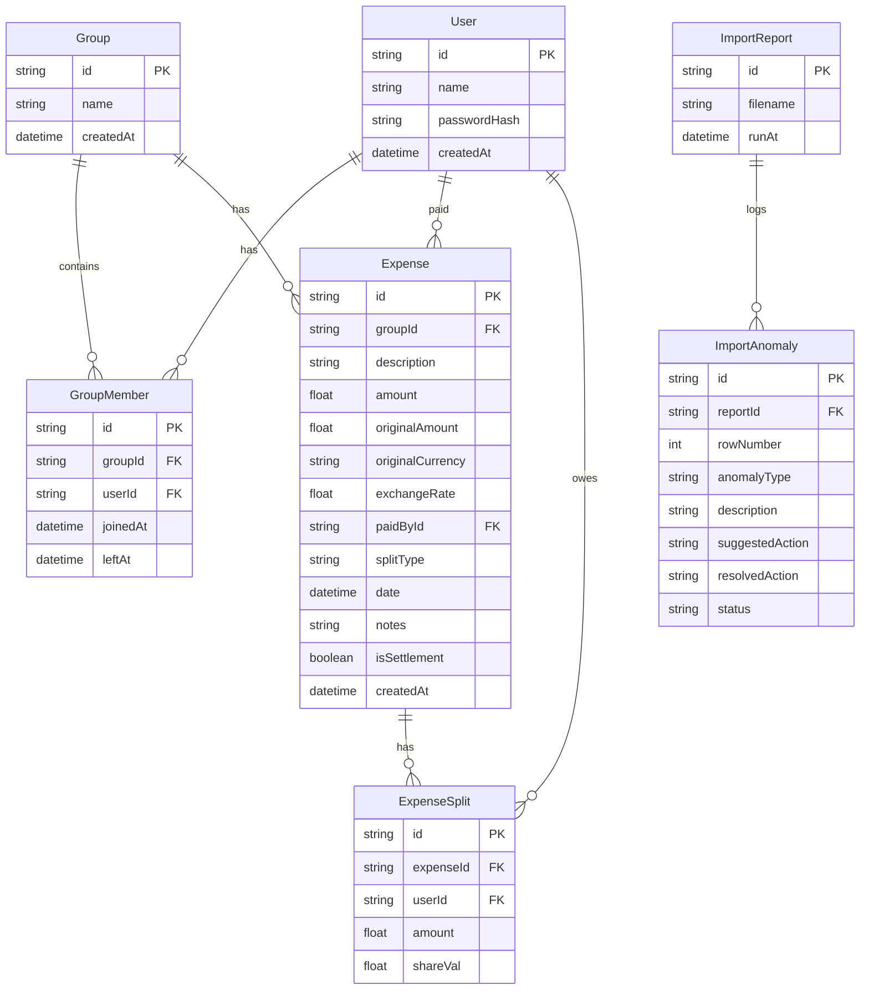

# SCOPE.md: Anomaly Log & Database Schema

This document details the anomaly log containing every data problem detected in the `expenses_export.csv` file, the policy chosen to resolve it, and the database schema implemented to enforce these rules.

---

## 1. CSV Anomaly Log & Resolution Policies

We detected 15 distinct data anomalies in `expenses_export.csv` during parsing and ingestion. Below is the full log of these anomalies and the resolution strategies applied:

### Anomaly 1: Near-Duplicate Expense Entries
- **Rows**: 5 & 6 (Marina Bites Dinner)
- **Problem**: Both rows represent the same event (Feb 8, Dev paid ₹3,200 split with Aisha, Rohan, Priya, Dev) but Row 6 has a slightly different description ("dinner - marina bites") and is missing notes.
- **Handling Policy**: Flagged as a duplicate. By default, Row 6 is discarded and Row 5 is kept to preserve the notes and standard spelling.

### Anomaly 2: Conflicting Entries (Same Event, Different Details)
- **Rows**: 24 & 25 (Thalassa Dinner)
- **Problem**: Both log a Thalassa Dinner on March 11, but Row 24 lists Aisha as the payer of ₹2,400, while Row 25 lists Rohan as the payer of ₹2,450. Rohan's note states: *"Aisha also logged this I think hers is wrong"*.
- **Handling Policy**: Flagged as a conflict. Based on the notes, Aisha's Row 24 is discarded and Rohan's Row 25 is kept as the correct ledger entry. The app allows the user to review and override this during import.

### Anomaly 3: Inconsistent Date Formats
- **Rows**: Multiple (e.g. Rows 16-26, 28-33, 34)
- **Problem**: Inconsistent date representations such as `YYYY-MM-DD` (Feb), `DD/MM/YYYY` (Mar), and `MMM DD` (Mar 14).
- **Handling Policy**: Standardized using multi-format parsing. Dates containing slashes are parsed as `DD/MM/YYYY`. Dates containing month names (e.g. `Mar 14`) are parsed and assigned the default year `2026` since all surrounding records are in 2026.

### Anomaly 4: Ambiguous Date Format
- **Rows**: 34 (Deep cleaning service)
- **Problem**: The date is `04/05/2026`. The notes ask: *"is this April 5 or May 4? format is a mess"*. It is positioned chronologically between March 28 and April 1.
- **Handling Policy**: Resolves to April 5th (`2026-04-05`) to maintain chronological consistency, as a May 4th date would be out of order and represent a post-occupancy event for Meera.

### Anomaly 5: Case-Sensitivity and Name Variations
- **Rows**: 9, 11, 27
- **Problem**: Names have lowercase versions (`priya`, `rohan `) or name modifiers (`Priya S`).
- **Handling Policy**: Trimmed and normalized using a strict roommate name mapping dictionary: `Priya S` and `priya` $\rightarrow$ `Priya`; `rohan ` $\rightarrow$ `Rohan`.

### Anomaly 6: Missing Payer
- **Rows**: 13 (House cleaning supplies)
- **Problem**: Payer field is blank. The notes say: *"can't remember who paid"*.
- **Handling Policy**: Blocked from silent import. The user must explicitly assign a roommate as the payer (defaulted to Rohan or Aisha after manual confirmation) to commit the transaction.

### Anomaly 7: Number Formatting (Commas in Strings)
- **Rows**: 7 (Electricity Feb)
- **Problem**: The amount is entered as `"1,200"` in quotes with a thousands separator comma.
- **Handling Policy**: Sanitized string values by removing quotes and commas before floating-point parsing.

### Anomaly 8: Excessive Decimal Precision
- **Rows**: 10 (Cylinder refill)
- **Problem**: The amount is logged as `899.995` INR, which cannot be represented directly in currency.
- **Handling Policy**: Rounded to two decimal places (`900.00` INR) and splits adjusted proportionally.

### Anomaly 9: USD Currencies
- **Rows**: 20, 21, 23, 26
- **Problem**: Priya's Request: *"Half the trip was in dollars. The sheet pretends a dollar is a rupee. That can’t be right."* USD amounts are entered but cannot be added directly to INR balances.
- **Handling Policy**: Created a multi-currency database schema. Enabled the user to define the conversion rate (default 1 USD = 83.00 INR) during import, storing both the original USD amount/currency and the converted INR amount.

### Anomaly 10: Missing Currency Field
- **Rows**: 28 (Groceries DMart)
- **Problem**: Currency column is empty.
- **Handling Policy**: Defaulted to the group's base currency `INR` after checking context.

### Anomaly 11: Negative Expense Amounts (Refunds)
- **Rows**: 26 (Parasailing refund)
- **Problem**: Amount is `-30` USD (representing a cancelled slot).
- **Handling Policy**: Logged as a negative expense (credit refund). Each split participant receives a negative balance debit, effectively reducing their total outstanding debt.

### Anomaly 12: Zero-Amount Expenses
- **Rows**: 31 (Dinner order Swiggy)
- **Problem**: Amount is `0` INR. Note says: *"counted twice earlier - fixing later"*.
- **Handling Policy**: Imported as a historical log record with an amount of `0.00` INR, preventing it from affecting roommate balances.

### Anomaly 13: Guest Member Splitting
- **Rows**: 23 (Parasailing)
- **Problem**: The split includes `Dev's friend Kabir`, who is not a group member.
- **Handling Policy**: Kabir is flagged as a guest. The user is prompted to choose whether to absorb Kabir's share (so Dev, who invited him, pays his share) or add him. By policy, Dev absorbs Kabir's share, meaning Dev is charged 2 shares of the split, and other participants pay 1 share.

### Anomaly 14: Percentage Splits Summing to > 100%
- **Rows**: 15 & 32
- **Problem**: Percentages are `Aisha 30%; Rohan 30%; Priya 30%; Meera 20%`, which sum to 110%.
- **Handling Policy**: Flagged as invalid. The percentages are normalized proportionally to sum to exactly 100% (e.g. each participant's share is multiplied by $100 / 110$).

### Anomaly 15: Temporal Membership Violations (Sam & Meera)
- **Rows**: 36 (April groceries including Meera), 39 & 40 (April utilities including Sam)
- **Problem**: Meera is split in April rent/groceries but left March 31. Sam is split in March electricity / early April utilities but only moved in mid-April.
- **Handling Policy**: Checked expense dates against the `joinedAt` and `leftAt` periods for all split participants. Inactive members are automatically excluded, and their shares are redistributed equally to active members.

---

## 2. Database Schema (Prisma/Relational)

We enforce referential integrity using SQLite/PostgreSQL tables. Below is our schema layout:

